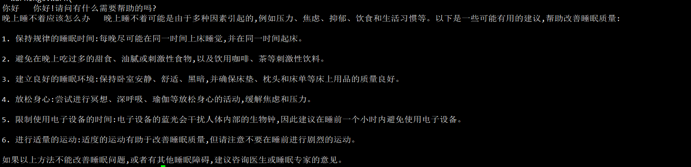

##  statement
- [deep_training](https://github.com/ssbuild/deep_training)

```text
    dev 分支加一些新功能和想法 如果求稳定，请使用 stable分支
    06-01 支持lora deepspeed 训练，0.1.9 和 0.1.10合并
    05-27 add qlora transformers>=4.30
    05-12 fix lora int8 多卡训练 , ppo training move to https://github.com/ssbuild/rlhf_chatglm
    04-28 deep_training 0.1.3 pytorch-lightning 改名 ligntning ，旧版本 deep_training <= 0.1.2
    04-23 增加lora 保存hf权重（修改infer_lora_finetuning.py enable_merge_weight 选项），超大数据集见训练节说明
    04-12 deep_training 0.1.2.post0 fix load_in_8bit in lora v1 , lora v2
    04-11 增加 lora v2 以及 adalora, 另外官方fix eos_token , 请更新tokenizer_config.json
    04-10 增加一直冻结前N层微调方式，根据需要修改models.py 变量 global_num_layers_freeze
    04-07 官方精简了词表和权重，配置已同步，建议重新下载权重信息 deep_training 最低要求 0.1.1
    04-02 增加p-tuning-v2训练, 建议训练前删除缓存数据 rm -rf output
    03-28 支持加载chatglm-6b-int4权重 (修改 对应配置文件quantization_bit 4 or 8)
    03-27 fix eos
    03-26 增加三种数据策略
```
   


## install
    
  - pip install -i https://pypi.org/simple -U -r requirements.txt

```text
dev 版本可通过下列方式安装 
pip install -i --pre https://pypi.org/simple deep_training==0.1.10 cpm_kernels bitsandbytes>=0.39
pip install -q -U git+https://github.com/huggingface/transformers.git
pip install -q -U git+https://github.com/huggingface/accelerate.git
```


## weight

- [chatglm-6b](https://huggingface.co/THUDM/chatglm-6b)   支持四种微调方式
- [chatglm-6b-int8](https://huggingface.co/THUDM/chatglm-6b-int8)  目前只支持ptv2微调和推理
- [chatglm-6b-int4](https://huggingface.co/THUDM/chatglm-6b-int4)  目前只支持ptv2微调和推理
    


## data sample
   第三方羊驼数据 https://github.com/hikariming/alpaca_chinese_dataset
    单条数据示例
```json
 {
     "id": 0, "paragraph": [
         {
             "q": "从南京到上海的路线",
             "a":  "你好，南京到上海的路线如下：1. 南京到上海，可以乘坐南京地铁1号线，在南京站乘坐轨道交通1号线。2. 南京到浦东机场，可以搭乘上海地铁1号，在陆家嘴站乘坐地铁1线，在浦东国际机场站乘坐机场快线，前往上海浦东国际机场。3. 上海到南京，可以换乘上海地铁2号线，从南京站换乘地铁2线，再从南京南站换乘地铁1路，然后到达上海站"
         }
     ]
 }
```
    或者
```json
 {
     "id": 0, "paragraph": [
         {
             "q": "从南京到上海的路线",
             "a": [
                 "你好，南京到上海的路线如下：",
                 "1. 南京到上海，可以乘坐南京地铁1号线，在南京站乘坐轨道交通1号线。",
                 "2. 南京到浦东机场，可以搭乘上海地铁1号，在陆家嘴站乘坐地铁1线，在浦东国际机场站乘坐机场快线，前往上海浦东国际机场。",
                 "3. 上海到南京，可以换乘上海地铁2号线，从南京站换乘地铁2线，再从南京南站换乘地铁1路，然后到达上海站"
             ]
         }
     ]
 }
```
   多轮会话
```json
 {
     "id": 0, "paragraph": [
        {
           "q": "你好",
           "a": "我是机器人，有什么可以帮助你的？"
        },
         {
             "q": "从南京到上海的路线",
             "a":  "你好，南京到上海的路线如下：1. 南京到上海，可以乘坐南京地铁1号线，在南京站乘坐轨道交通1号线。2. 南京到浦东机场，可以搭乘上海地铁1号，在陆家嘴站乘坐地铁1线，在浦东国际机场站乘坐机场快线，前往上海浦东国际机场。3. 上海到南京，可以换乘上海地铁2号线，从南京站换乘地铁2线，再从南京南站换乘地铁1路，然后到达上海站"
         }
     ]
 }

```


## infer
    # infer.py 推理预训练模型
    # infer_finetuning.py 推理微调模型
    # infer_lora_finetuning.py 推理lora微调模型
     python infer.py


| **量化等级**    | **最低 GPU 显存** |
| -------------- | ----------------- |
| FP16（无量化）   | 13 GB             |
| INT8           | 10 GB              |
| INT4           | 6 GB               |

   



## finetuning
```text
    制作数据
    python data_utils.py
    注: num_process_worker 为多进程制作数据 ， 如果数据量较大 ， 适当调大至cpu数量
    dataHelper.make_dataset_with_args(data_args.train_file,mixed_data=False, shuffle=True,mode='train',num_process_worker=0)
    
    训练
    python train.py
```

### 单机多卡
```text
可见的前两块卡
train_info_args = {
    'devices': 2,
}

# 第一块 和 第三块卡
train_info_args = {
    'devices': [0,2],
}
```

### 多机多卡训练
```text
例子 3个机器 每个机器 4个卡
修改train.py Trainer num_nodes = 3
MASTER_ADDR=10.0.0.1 MASTER_PORT=6667 WORLD_SIZE=12 NODE_RANK=0 python train.py 
MASTER_ADDR=10.0.0.1 MASTER_PORT=6667 WORLD_SIZE=12 NODE_RANK=1 python train.py 
MASTER_ADDR=10.0.0.1 MASTER_PORT=6667 WORLD_SIZE=12 NODE_RANK=2 python train.py 
```

## 切换训练模式配置
    修改 config/main.py
    # 模块配置， 默认启用lora
    enable_deepspeed = False
    enable_ptv2 = True
    enable_lora = True
    enable_int8 = False # qlora int8
    enable_int4 = False # qlora int4

    

### lora finetuning
```text
        global_args = {
           "load_in_8bit": False, # lora 如果显卡支持int8 可以开启 ， 需安装依赖 pip install bitsandbytes
           "num_layers_freeze": -1, # 非lora,非p-tuning 模式 ， <= config.json num_layers
           "pre_seq_len":  None,    #p-tuning-v2 参数
           "prefix_projection": False, #p-tuning-v2 参数
           "num_layers": -1, # 是否使用骨干网络的全部层数 最大1-28， -1 表示全层, 否则只用只用N层
        }
         lora_info_args = {
               'with_lora': True,  # 是否启用lora模块
               'r': 8,
               'target_modules': ['query_key_value'],
               'target_dtype': None,
               'lora_alpha': 32,
               'lora_dropout': 0.1,
               'bias': 'none',  # Bias type for Lora. Can be 'none', 'all' or 'lora_only'"
               'modules_to_save' : None, # "help": "List of modules apart from LoRA layers to be set as trainable and saved in the final checkpoint. "
        }
```
    

### ptuning v2
 
    对于 deepspeed模式 , ptuning v2  只支持 stage 0

```text
    global_args = {
            "load_in_8bit": False, # lora 如果显卡支持int8 可以开启 ， 需安装依赖 pip install bitsandbytes
            "num_layers_freeze": -1, # 非lora,非p-tuning 模式 ， <= config.json num_layers
            "pre_seq_len":  32,    #p-tuning-v2 参数
            "prefix_projection": False, #p-tuning-v2 参数
            "num_layers": -1, # 是否使用骨干网络的全部层数 最大1-28， -1 表示全层, 否则只用只用N层
        }

```


### freeze

    
```text
    global_args = {
            "load_in_8bit": False, # lora 如果显卡支持int8 可以开启 ， 需安装依赖 pip install bitsandbytes
            "num_layers_freeze": 14, # 非lora,非p-tuning 模式 ， <= config.json num_layers
            "pre_seq_len":  None,    #p-tuning-v2 参数
            "prefix_projection": False, #p-tuning-v2 参数
            "num_layers": -1, # 是否使用骨干网络的全部层数 最大1-28， -1 表示全层, 否则只用只用N层
    }
    
 

```

## 全参数微调

```text
    global_args = {
            "load_in_8bit": False, # lora 如果显卡支持int8 可以开启 ， 需安装依赖 pip install bitsandbytes
            "num_layers_freeze": -1, # 非lora,非p-tuning 模式 ， <= config.json num_layers
            "pre_seq_len":  None,    #p-tuning-v2 参数
            "prefix_projection": False, #p-tuning-v2 参数
            "num_layers": -1, # 是否使用骨干网络的全部层数 最大1-28， -1 表示全层, 否则只用只用N层
        }
   lora_info_args = {
       'with_lora': False,  # 是否启用lora模块
        ...
   }
   adalora_info_args = {
       'with_lora': False,  # 是否启用lora模块
        ...
   }
```

## 精度训练
    precision = '16' # 半精度训练 "32": "32-true", "16": "16-mixed", "bf16": "bf16-mixed"


### int高效训练方式
1.p-tuning-v2   使用chatglm-6b-int4 or chatglm-6b-int8  或者 chatglm-6b 权重

```text
        global_args = {
            "load_in_8bit": False, # lora 如果显卡支持int8 可以开启 ， 需安装依赖 pip install bitsandbytes
            "num_layers_freeze": -1, # 非lora,非p-tuning 模式 ， <= config.json num_layers
            "pre_seq_len":  32,    #p-tuning-v2 参数
            "prefix_projection": False, #p-tuning-v2 参数
            "num_layers": -1, # 是否使用骨干网络的全部层数 最大1-28， -1 表示全层, 否则只用只用N层
        }
```
2.lora int8

```text      
         global_args = {
           "load_in_8bit": True, # lora 如果显卡支持int8 可以开启 ， 需安装依赖 pip install bitsandbytes
           "num_layers_freeze": -1, # 非lora,非p-tuning 模式 ， <= config.json num_layers
           "pre_seq_len":  None,    #p-tuning-v2 参数
           "prefix_projection": False, #p-tuning-v2 参数
           "num_layers": -1, # 是否使用骨干网络的全部层数 最大1-28， -1 表示全层, 否则只用只用N层
        }
        lora_info_args = {
               'with_lora': True,  # 是否启用lora模块
               'r': 8,
               'target_modules': ['query_key_value'],
               'target_dtype': None,
               'lora_alpha': 32,
               'lora_dropout': 0.1,
               'bias': 'none',  # Bias type for Lora. Can be 'none', 'all' or 'lora_only'"
               'modules_to_save' : None, # "help": "List of modules apart from LoRA layers to be set as trainable and saved in the final checkpoint. "
        }
3.lora int4

```text      
        global_args = {
            "load_in_8bit": False, # qlora int8
            "load_in_4bit": True, # qlora int4
        
            # load_in_4bit 量化配置
            "quantization_config": BitsAndBytesConfig(
                load_in_4bit=True,
                llm_int8_threshold=6.0,
                llm_int8_has_fp16_weight=False,
                bnb_4bit_compute_dtype=torch.float16,
                bnb_4bit_use_double_quant=True,
                bnb_4bit_quant_type="nf4",
            ),
            "num_layers_freeze": -1, # 非lora,非p-tuning 模式 ， <= config.json num_layers
            "pre_seq_len": None,    #p-tuning-v2 参数 , None 禁用p-tuning-v2
            "prefix_projection": False, #p-tuning-v2 参数
            "num_layers": -1, # 是否使用骨干网络的全部层数 最大1-28， -1 表示全层, 否则只用只用N层
        }
        lora_info_args = {
               'with_lora': True,  # 是否启用lora模块
               'r': 8,
               'target_modules': ['query_key_value'],
               'target_dtype': None,
               'lora_alpha': 32,
               'lora_dropout': 0.1,
               'bias': 'none',  # Bias type for Lora. Can be 'none', 'all' or 'lora_only'"
               'modules_to_save' : None, # "help": "List of modules apart from LoRA layers to be set as trainable and saved in the final checkpoint. "
        }
 ```

### 超大数据集
    修改data_utils.py "data_backend": "lmdb" 

## deepspeed
    启动则将data_utils.py  修改 enable_deepspeed 
    lora 模式暂时不支持deepspeed

## 关于续写
    训练 q 置空
    推理如下
    model = pl_model.get_glm_model()
    model.generate_for_continue_writing(tokenizer, "请帮我续写一段关于春天文字的文字", max_length=2048,
                                            eos_token_id=config.eos_token_id,
                                            do_sample=True, top_p=0.7, temperature=0.95,)
    

## Reference
    https://github.com/THUDM/ChatGLM-6B

## 友情链接

- [pytorch-task-example](https://github.com/ssbuild/pytorch-task-example)
- [tf-task-example](https://github.com/ssbuild/tf-task-example)
- [chatmoss_finetuning](https://github.com/ssbuild/chatmoss_finetuning)
- [chatglm_finetuning](https://github.com/ssbuild/chatglm_finetuning)
- [chatyuan_finetuning](https://github.com/ssbuild/chatyuan_finetuning)
- [llm_finetuning](https://github.com/ssbuild/llm_finetuning)
- [rlhf_llm](https://github.com/ssbuild/rlhf_llm)
- [rlhf_chatglm](https://github.com/ssbuild/rlhf_chatglm)
- [rlhf_chatyuan](https://github.com/ssbuild/rlhf_chatyuan)

## 
    纯粹而干净的代码

## Star History

[](https://star-history.com/#ssbuild/chatglm_finetuning&Date)

